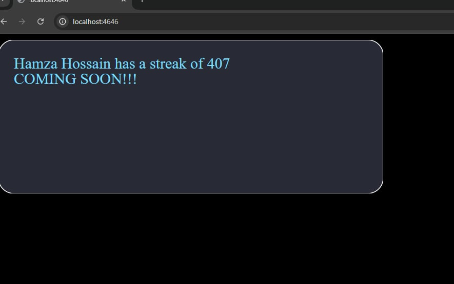

# PIMP MY README
Modular customizable readme graphic generator for github [WIP]

## How to run

- Clone this repositoy
- Modify `.env.example` and rename to `.env`
- `npm install`
- `npm run dev`

## Features
- Modular: Can generate single individual cards or one accumulative one
- Generates the user's maximum and current github streak
- Displays `Github` stats such as commit count, stars, etc.
- Fetches `LeetCode` data of the user
- Fetches `CodeForces` data of the user
- Multiple customizable Themes
- Backend server generates the requested graphics dynamically

## Tech
- `ExpressJs` for the backend server
- `GraphQL` for making github and leetcode API requests
- `SVG.js` for generating vector graphics (cards)
- `husky` for auto-linting
- `ESLint` for code-linting
- `Prettier` for code formatting
- `Docker` contained project

## Current DEMO

## Plans
- Add customizable stats
- Accumulate number of problems solved across every site
- Implement docker
## Acknowledgements
Heavily inspired by [Anuraghazra's README Stats](https://github.com/anuraghazra/github-readme-stats) and [DenverCoder1's Github Streak](https://github.com/DenverCoder1/github-readme-streak-stats).